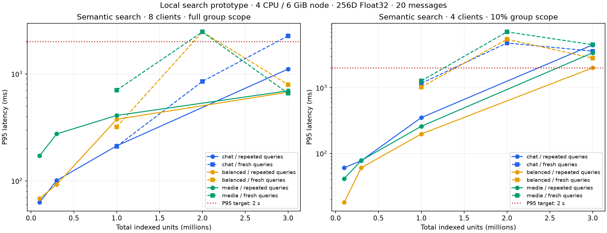

# 混合消息检索容量：实测记录

在本次 **4 核 / 6 GiB、P95 ≤ 2 秒、每次 20 条消息** 的引擎压测口径下，三种主题聚类混合语料共同通过的检查点是 **约 100 万检索单元**。
200 万单元的新查询已经出现超标；300 万能返回结果，但不能据此宣称稳定满足 2 秒目标。实测边界在 100 万与 200 万单元之间，不能插值成精确硬上限。

## 可确认的混合数据规模

| 混合比例：文字/图片/音频/视频 | 总检索单元 | 当前 group 可搜索消息 | 100 万点最差 P95 | 200 万点最差 P95 |
| --- | ---: | ---: | ---: | ---: |
| 90/5/4/1 | 1,000,000 | 452,848 | 1.17 秒 | 4.80 秒 |
| 60/20/15/5 + 长视频尾部 | 1,000,032 | 151,549 | 1.02 秒 | 5.46 秒 |
| 20/20/30/30 | 1,000,010 | 43,020 | 1.27 秒 | 7.07 秒 |

这是本次合成语料与固定配置的引擎能力，尚不是完整产品 SLA。三组语义查询在 100 万点的平均 Recall@20 均不低于 99.2%；准确率来自逐向量精确对照。

通过条件为每个已测条件 P95 ≤ 2 秒、平均语义 Recall@20 ≥ 95%、无请求错误、无范围串入或重复消息。并发为闭环客户端，不代表任意到达速率下的排队 SLA。

## 测试条件

以下为本机独立 OpenSearch 3.8.0 原型的数据，生产搜索入口尚未接入。
节点限制为 4 CPU、6 GiB 总内存、2 GiB JVM heap；宿主机 Apple M5 / 32 GiB。
数据为合成的 256 维向量与模拟文字/OCR/转写/视频片段文本，没有真实媒体文件；只测试索引后的检索。
不计 OCR/ASR、WeMM 查询编码、远程网络或 PG/canonical 最终状态校验。
查询覆盖两年时间与最多 10,000 个频道；总库含约 5% 其他租户数据，授权消息数量单独统计。

## 全部检查点

| 混合类型 | 查询组 / ef | 总检索单元 | 总消息 | 本 group 可搜索消息 | 全范围 C8 P95 ms | 10%范围 C4 P95 ms | C8 平均 Recall@20 |
| --- | --- | ---: | ---: | ---: | ---: | ---: | ---: |
| balanced | 24 查询 × 3 / 200 | 100,194 | 15,952 | 15,155 | 68.3 | 18.0 | 99.79% |
| balanced | 24 查询 × 3 / 200 | 300,005 | 48,156 | 45,749 | 92.4 | 60.6 | 100.00% |
| balanced | 24 查询 × 3 / 200 | 1,000,032 | 159,525 | 151,549 | 376.2 | 197.7 | 99.79% |
| balanced | prefix-fresh64 / 200 | 1,000,032 | 159,525 | 151,549 | 319.1 | 1020.8 | 99.30% |
| balanced | prefix-fresh64 / 200 | 2,000,042 | 319,724 | 303,738 | 2469.0 | 5464.7 | 99.06% |
| balanced | 24 查询 × 3 / 200 | 3,000,011 | 477,726 | 453,840 | 674.9 | 2009.9 | 98.33% |
| balanced | fresh64 / 200 | 3,000,011 | 477,726 | 453,840 | 793.8 | 2827.0 | 98.20% |
| chat | 24 查询 × 3 / 200 | 100,001 | 47,469 | 45,096 | 62.8 | 60.5 | 100.00% |
| chat | 24 查询 × 3 / 200 | 300,001 | 141,832 | 134,741 | 100.9 | 77.7 | 100.00% |
| chat | 24 查询 × 3 / 200 | 1,000,000 | 476,682 | 452,848 | 212.3 | 351.1 | 100.00% |
| chat | prefix-fresh64 / 200 | 1,000,000 | 476,682 | 452,848 | 209.8 | 1166.6 | 100.00% |
| chat | prefix-fresh64 / 200 | 2,000,030 | 953,432 | 905,761 | 849.9 | 4795.7 | 99.77% |
| chat | 24 查询 × 3 / 200 | 3,000,004 | 1,435,053 | 1,363,301 | 1108.8 | 4493.0 | 99.79% |
| chat | fresh64 / 200 | 3,000,004 | 1,435,053 | 1,363,301 | 2267.0 | 3606.1 | 99.69% |
| diffuse | 24 查询 × 1 / 200 | 100,007 | 17,945 | 17,048 | 33.1 | 40.5 | 83.13% |
| diffuse | 24 查询 × 1 / 200 | 300,006 | 52,713 | 50,078 | 388.7 | 71.0 | 76.67% |
| diffuse | tuned2000 / 2000 | 300,006 | 52,713 | 50,078 | 292.9 | 46.9 | 97.71% |
| media | 24 查询 × 3 / 200 | 100,007 | 4,441 | 4,219 | 171.4 | 41.3 | 96.88% |
| media | 24 查询 × 3 / 200 | 300,034 | 13,394 | 12,725 | 274.8 | 78.3 | 98.54% |
| media | 24 查询 × 3 / 200 | 1,000,010 | 45,284 | 43,020 | 408.6 | 259.0 | 99.38% |
| media | prefix-fresh64 / 200 | 1,000,010 | 45,284 | 43,020 | 704.6 | 1272.1 | 99.30% |
| media | prefix-fresh64 / 200 | 2,000,040 | 90,488 | 85,964 | 2468.0 | 7073.7 | 98.67% |
| media | 24 查询 × 3 / 200 | 3,000,017 | 135,424 | 128,653 | 694.8 | 3403.2 | 97.50% |
| media | fresh64 / 200 | 3,000,017 | 135,424 | 128,653 | 658.1 | 4523.2 | 97.73% |

## 100 万检查点的质量与吞吐

每条件 64 个独立查询；最低单次召回另列，避免用平均值掩盖漏召回。QPS 为该闭环测试的实测值，未做恒定到达速率的过载测试。

| 混合类型 | 全范围 C8 QPS | 10%范围 C4 QPS | 所有语义条件中最低平均召回 | 最低单次召回 | 最低满页率 |
| --- | ---: | ---: | ---: | ---: | ---: |
| balanced | 34.6 | 15.3 | 99.30% | 90.0% | 100.0% |
| chat | 50.8 | 16.1 | 99.92% | 95.0% | 100.0% |
| media | 17.2 | 9.7 | 99.30% | 90.0% | 100.0% |

## 解读边界

- `chat` 消息比例为文字/图片/音频/视频 90/5/4/1；`balanced` 为 60/20/15/5 并有长视频尾部；`media` 为 20/20/30/30。
- 单条普通文字/图片/音频/视频分别生成 1/2/12/60 个单元；长视频可有 500 个。不能把检索单元数量当成消息数量。
- 默认测量重复 24 个查询三遍；标为 fresh 的测量每个条件使用不同种子的全新查询，不显式预热，但没有清除共享宿主机 OS 页缓存。
- 合成数据的 Recall@20 验证 ANN 是否找回精确近邻，不代表真实图片、语音或中文语义理解质量。
- 已通过的检查点只是该配置/负载下的下界。必须结合更大失败点、过滤比例、并发数和冷热状态讨论容量。
- 200 万和 300 万的延迟并非单调：段布局、后台合并和缓存状态不同。两者均已在部分测试条件下超标，不能用某一次较快结果覆盖较慢结果。
- 300 万文字为主数据的 10% 范围查询，重复三轮的 P95 为 5.27 秒、1.13 秒、0.307 秒，说明仅看重复查询会掩盖首次查询和缓存压力。独立种子的新查询又在三种混合比例上测得约 2.83–4.52 秒。
- 报告不把新入口、group owner 授权、完整发布/回源校验或 Cloud 迁移描述为已实现。

## 向量分布与参数敏感性

额外的 diffuse 语料保留相同消息结构，但使用随机分散的消息方向。默认 ef/k=200 时，10 万和 30 万单元的平均 Recall@20 仅为 83.1% 和 76.7%，速度快也不能算达标。
同一 30 万索引、同一查询和精确对照集，将搜索力度调到 ef/k=2000 后，平均 Recall@20 提高到 97.7%。这说明容量结论依赖搜索参数和向量分布；该结果未外推到 100 万或真实 WeMM 数据。调参前后的缓存状态不同，不把延迟变化全归因于参数。

## 长视频与消息归并

真实引擎中，一条视频的 500 个高分片段加 40 条其他消息，先取 200 个片段再 collapse 仅返回 1 条消息；nested 多向量消息召回返回 20 条。
固定窗口内 41 条消息分页为 20/20/1，未出现重复；scope 字段刷新后删除了不再符合该 scope 的结果。此项是索引过滤验证，不替代产品 owner 撤销协议。

## ClickHouse 窄表对照

ClickHouse 26.8.2.7 同样限制为 4 核 / 6 GiB；独立于 OpenSearch 运行。使用相同均衡语料前缀，12 个查询重复两遍，每条件 24 次，样本数较主测少。
精确路径在数据库内按消息取最佳片段，再获取有限片段；ANN 路径先取 200 个片段再归并。二者不是生产中仍限定单频道/14 天的原 SQL。

| 总检索单元 | 算法 | 全范围 C8 P95 ms | 10%范围 C4 P95 ms | C8 平均 Recall@20 | C8 错误数 |
| ---: | --- | ---: | ---: | ---: | ---: |
| 100,194 | exact | 106.3 | 22.3 | 100.00% | 0 |
| 100,194 | ann200 | 79.5 | 19.5 | 87.08% | 0 |
| 300,005 | exact | 667.4 | 112.3 | 100.00% | 0 |
| 300,005 | ann200 | 182.9 | 33.2 | 95.83% | 0 |
| 1,000,032 | exact | 2514.6 | 158.1 | 100.00% | 0 |
| 1,000,032 | ann200 | 1041.3 | 144.4 | 96.67% | 0 |

**失败点：3,000,011 单元、exact 路径预热失败：** TIMEOUT_EXCEEDED: elapsed 10033.170 ms, maximum 10000.000 ms。该算法在此规模没有完成并发测量，不能将缺失行视为通过。

3,000,011 单元的 ann200 后续测量在 C1 就出现错误：P95 9.83 秒，24 次中 2 次超时，成功请求平均 Recall@20 89.32%（最低 55.0%）。因此停止加并发，未生成 C4/C8 通过数据。

ANN 不能只凭延迟替代完整消息召回：部分较小检查点平均 Recall@20 低于 95%，后台合并期间同一批查询的召回也有变化。长视频挤占还需用完整产品语料验证。
早期导出的 EXPLAIN 使用服务器默认 rescoring=0，仅用于确认 HNSW 索引参与；实际计时请求使用 rescoring=1。最终另存带相同请求设置的计划，不把默认计划冒充实际计时计划。

## 原始结果复核与资源观测

OpenSearch 的 11,160 次计时请求没有搜索错误；包含 ClickHouse 的全部 11,904 次计时请求中有 2 次错误，另有 1 次预热失败，均保留。没有跳过的计时请求。
逐一对照生成器元数据检查了 235,656 个返回命中，未发现租户/group-connect/日期范围串入、超出被测语料前缀或单页重复消息。这只验证本实验的范围过滤。
两个节点的 cgroup 观测峰值均触及 6 GiB 上限，均未记录 OOM kill；页回收和 CPU throttling 计数保存在资源文件中。OpenSearch 资源监控有 8 个失败采样点，查询结果记录未丢失。这些观测提示资源压力，不能单独证明某个延迟尖峰的因果。

## 复跑与证据

脚本、固定依赖与方法见 [README](../../README.md)；同目录的 `.json.gz` 保留逐请求延迟、结果 ID、召回与错误。`summary.json` 是便于读取的汇总。
`audit.json` 将原始结果 ID 与生成器的消息元数据逐一核对，检查租户、group/connect 范围、日期、语料前缀及去重。`environment.json` 保存节点资源配置和观测汇总；资源原始采样单独压缩保存。
节点、模型和原始媒体链路尚未集成到 agent 的正式搜索入口。本次没有部署、改动生产数据或向外部 provider 发起压测。
