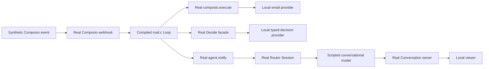

# Proactive chat prototype

This local prototype checks whether existing Salix components can deliver an unsolicited Router chat message from an email event.
It is not installed by PR #1970 and is not a production watcher.

## Run

From the repository root:

```sh
make prototype-proactive-chat
```

Open the printed `PROTOTYPE_URL`.
Use the scenario selector to inspect source input, decision requests, Session wakes, and actual Conversation messages.
The page shows whether the scenario checks passed.
A passing failure scenario means the simulator reproduced that failure, not that delivery succeeded.

Other modes:

```sh
make prototype-proactive-chat PROACTIVE_PROTOTYPE_ARGS=--all
bash systems/scripts/proactive-chat-prototype/run.sh --case important
bash systems/scripts/proactive-chat-prototype/run.sh
```

The last command opens a terminal menu.
Batch mode writes `results.local.json` and returns a nonzero exit code if a scenario fails its checks.
Requirements: Docker, the repository's Elixir dependencies, and its native build toolchains.
The launcher uses separate PostgreSQL and Redis containers on loopback ports.
It reads each allocated port after startup.
It never reads Gmail credentials or calls a real model provider.

Stop the running command with Ctrl-C.
Stop the prototype dependencies when finished:

```sh
docker stop comma-proactive-prototype-pg comma-proactive-prototype-redis
```

The database belongs to this prototype and is reset on each start.
The local S3 test backend retains messages only within the running process.
These are not whole-service persistence or disaster-recovery tests.

## What executes



- `mail.c` is the proposed workflow, compiled through the existing spinfoam build service.
- The email fixture requires an exact synthetic message ID and `include_payload=true`.
- Gmail query construction, MIME parsing, OAuth consent, and live trigger registration remain unverified.
- The decision fixture reads the body. It selects `notify` for `before 17:00`, `quiet` for `No action`, and `defer` otherwise.
- This fixture checks data flow and branching. It does not evaluate model usefulness or resistance to prompt injection.
- The chat model checks its first request for the source body, then returns a scripted send tool call.
- The normal Session tool path writes the visible message through the Conversation owner.
- The Loop acknowledges the event after a quiet decision or successful durable Session admission.
- An acknowledgement means processing reached that handoff. The viewer separately checks that a visible message exists.
- The simulator creates an isolated Salix Router Conversation. Comma login, Workspace mapping, and client subscriptions remain unverified.

## Scenarios and findings

| Scenario | Expected result |
| --- | --- |
| important | One visible reminder. The first chat-model request contains the body. |
| quiet | Same subject, opposite body. No reminder. |
| missing_body | Source error. No model request and no acknowledgement. |
| model_error | Two failed attempts, then an explicit error checkpoint. No reminder. |
| uncertain | Defer with no acknowledgement. No fabricated quiet decision. |
| duplicate | One source read, one decision, and one visible reminder after repeated event delivery. |
| foreign_account | HTTP 422 before source read or model use. |
| restart | The durable inbox replays a 202 event after owner restart, without upstream redelivery; later redelivery remains a duplicate. |
| model_redelivery | Redelivery of a failed event is suppressed by runtime deduplication, even without a business acknowledgement. |
| model_retry | The Loop retains the event and retries once after provider recovery. One visible reminder. |

spinfoam v0.1.2 remembers event IDs on mailbox admission, not on business completion.
Do not use provider redelivery as the model retry mechanism.
The prototype keeps one event during its bounded model retry.
The Loop inbox now persists accepted events before HTTP 202 and replays them after owner restart.
The inbox retains up to 32 events of at most 16 KiB each. Events that do not complete within 15 minutes fail the Loop visibly; manual resume retries retained work.
This simulator verifies an owner restart with live PostgreSQL, not loss of the database or whole-service object storage.

## Integration with existing owners

The user wants GTD-style capture, clarification, review, and action within Comma's existing system.
The product implementation follows these owners. The ten-scene simulator remains an ingress and delivery harness; product integration tests separately cover consent, Task association and real one-shot Schedule dispatch.

| Responsibility | Existing owner and use |
| --- | --- |
| Receive new evidence | Composio binding and Loop. Keep exact account and source references; persist accepted events at this existing ingress. |
| Decide what needs action | Router and its existing tools. Use bounded screening before waking the Router; evaluate the final decision with current context. |
| Remind at a known time | `proactive.mail_schedule` validates the owner and source, then records one Home-owned value and uses the shared Schedule receiver. |
| Perform sustained delegated follow-up | One existing Task and Worker, with an explicit outcome and source references. Later evidence continues that Task. |
| Revisit waiting work | The shared `SalixCluster.Schedules` dispatcher. Recheck the source before deciding to speak. |
| Show work and results | Existing Conversation messages, ProductInbox projections, and Routine source/Task references. |

A person's obligation and a Comma Task have different meanings.
For example, paying a bill is the person's action; monitoring its due date and reporting when action is needed is work delegated to Comma.
Do not create a Task for every incoming email or add GTD categories as competing Task lifecycle states.
Keep source changes and follow-up conclusions in the existing Task context.
Task status remains owned by Conversation; automatic success reaches `ready_for_review`, while explicit human acceptance owns `completed`.
Routine cards must project current facts and route actions to the existing owner, rather than keeping their own completion state.

The shared scheduler already owns due-time indexing, run claims, pause, and dispatch recovery for Agent, Task, and Routine receivers.
The Agent tool accepts one-shot `run_at`; the current Task binding accepts only `interval_minutes`, `cron`, and `timezone`.
Home mail reminders use the shared `comma_mail` receiver. Generic Agent and Task Schedule contracts remain unchanged.
Do not add a second scheduler or use the Loop mailbox as the long-term follow-up store.
Webhook recovery belongs to the durable Loop inbox; scheduled follow-up recovery belongs to the shared scheduler.

## Next iterations

- [x] Validate exact owner/account consent and the fixed Comma Home Router destination in product integration tests.
- [x] Persist accepted events at Loop ingress and replay after owner restart.
- [x] Invoke the real shared scheduler at a supplied due time and re-read mail under the current owner binding.
- [ ] Cover bill due dates, pending personal action, and waiting for a reply. A check time is not itself proof that work is overdue.
- [x] Verify canonical Task completion before and during a source read suppresses follow-up evidence.
- [ ] Verify that repeated unchanged checks stay quiet and do not create extra Tasks.
- [ ] Let the Router suppress an important-source alert that the current conversation already handled; preserve a useful alert for changed facts.
- [x] Project linked mail as the existing Task and hide stopped Tasks using canonical UI state.
- [ ] Validate authorized live Gmail samples and installed Comma presentation. `quality.exs` evaluates six synthetic mail cases with real Jev; this is model-quality evidence, not live-account acceptance.

## Real-model Home acceptance

`acceptance.exs` starts the real Comma API, Router, Worker, scheduler, and S3 adapter.
It replaces only the Gmail and Composio transport with fictional mail.
It permits no outbound email operations.
The browser test uses the actual web app without intercepted product requests.

This opt-in fixture requires an authorized model configuration in a private JSON file.
Set `MAIL_ACCEPTANCE_MODEL_CONFIG` to that file. It contains `decide` and `llm` configuration.
Never commit the configuration or `acceptance.local.json`, which contains a test session token.
The fixture uses local PostgreSQL port 32787, Redis port 32786, and MinIO port 32790.
Its databases are `comma_mail_acceptance`, `comma_mail_acceptance_comma`, and `comma_mail_acceptance_billing`.
Its S3 bucket is `comma-proactive-acceptance`. Do not share these with another service.
`--reset` resets the named Salix test database and creates a fresh fictional workspace.
Omit it to retain the existing workspace and generated monitor for diagnosis.

From `systems`, run:

```sh
MIX_ENV=test SALIX_TEST_DB_PORT=32787 COMMA_TEST_DB_PORT=32787 \
SALIX_TRANSFER_PORT=0 REDIS_URL=redis://127.0.0.1:32786/1 \
mix run --no-start --no-compile scripts/proactive-chat-prototype/acceptance.exs --reset
```

The browser acceptance for Home reminder cards and the proactive switch was retired with that UI.
Proactive reminders are now ordinary Home chat messages from a recurring check.
`CommaWeb.LocalRecommendationFlowTest` covers the check, its judgment and its message budget.
The fixture remains for diagnosing fictional mail with real models. It is not live Gmail acceptance.

## Decision comparison harness

Use `harness/` for model comparisons. The older `compare*.exs` results are historical experiments.
This harness does not start product applications, read a mailbox, or publish messages.
Its output contract is experimental. It is not yet the production Home card contract.

Run the local checks before paid provider calls:

```sh
bash systems/scripts/proactive-chat-prototype/harness/check.sh
```

The checks cover provider return variants, error classification, source ownership, fact checks, and call accounting.
The runtime check compiles a test-only C probe and verifies source/decision envelopes, state responses, duplicate notification responses, and ACK responses.
It also rejects a guest that guesses defer without a decision.
The probe is never supplied to a code-generation model.
No credentials, database, or network model provider are required for these checks.
Elixir dependencies and the existing spinfoam compiler/runtime must be available.

From `systems`, run a real-provider comparison:

```sh
MIX_ENV=test mix run --no-start --no-compile \
  scripts/proactive-chat-prototype/harness/run.exs \
  --config /absolute/path/to/private-model-config.json \
  --corpus scripts/proactive-chat-prototype/harness/evaluation.json \
  --output /absolute/path/to/new-run-directory \
  --variants a,b,c --rounds 2
```

The private configuration uses the same `decide` and `llm` fields as the Home acceptance fixture.
Do not commit it. The manifest records model names and prompts, but no endpoint or credential.
Each run requires a new output directory. It preserves failed trials and writes one JSONL row per settled trial.
The runner uses two concurrent trials, at most five rounds, and a 60-second trial limit for A/B/C.
Router requests have a 30-second receive timeout. Jev uses its existing two-second provider timeout.
There are no application retries. Cache state is uncontrolled. Timeout rows mark their call accounting incomplete.

| Variant | Model input and flow |
| --- | --- |
| `a` | Jev sees mail and Home. Code builds fixed excerpt text. |
| `b` | Jev sees mail only. A notify result reaches Router with mail and Home. |
| `c` | Router sees mail and Home for every case. |
| `b_context` | Same B flow and prompts, but Jev also receives Home. This isolates context availability. |
| `d` | A frozen generated C program runs through the real compiler and event runtime. Its Router calls use the common output contract. |

All variants use the same output: decision, optional title/body, source reference, and allowed actions.
Code supplies the source and actions from the case fixture. The model cannot create either field.
Quiet and defer produce no card. Provider, decoder, and output-contract errors remain errors.
A valid shape does not prove that every statement is correct. Fact anchors check selected details, and `drafts.json` retains text for inspection.
Chinese clock digits such as 三点 and 3点 are equivalent. A changed time still fails the check.

`development.json` contains the eight historical cases.
`evaluation.json` contains 24 additional cases and declared expected outcomes.
Three pairs change only Home interests. Their labels are explicit experimental policy, not representative inbox frequencies.
Expected outcomes and fact anchors never reach a provider.
The run records complete fictional decision inputs and bounded outputs, so do not substitute real private mail without adapting data handling.
Repeated runs of this corpus are regressions, not fresh held-out evaluation.

To run D, add `--variants d --d-source /absolute/path/to/generated.c`.
The supplied program is copied into the result directory.
One runtime object handles each corpus pass. The host limits each event to 32 capability calls.
A timeout or call-budget failure unloads the object. Later events report unavailable instead of inheriting a runaway program.
A frozen-program pass does not prove reliable cold generation, durable queues, permission checks, recovery, or UI delivery.
D source/ACK adapters are synthetic. Actual Jev and Router-model calls remain real.

Result files:

- `manifest.json`: prompts, model names, limits, and comparison scope.
- `corpus.json`: the exact inputs and labels used.
- `rows.jsonl`: each trial, provider stages, outputs, timings, errors, and observed usage.
- `summary.json`: decisions, missing reminders, errors, selected fact gaps, calls, and tokens.
- `drafts.json`: shared card outputs for inspection.
- `completed.json`: expected and settled row counts. A completed run can contain quality failures.

Unknown usage is not zero cost. Summaries report usage coverage per provider.
Rejected Jev responses retain observed token usage when available.
Currency cost remains unknown until an authoritative tariff is supplied.
Exit code 2 indicates at least one execution/contract error. A fully scored quality failure does not crash the runner.
Always inspect the summary rather than treating exit code 0 as model-quality acceptance.

Render a report without more model calls:

```sh
python3 scripts/proactive-chat-prototype/harness/report.py /absolute/path/to/run-directory
```

If a scorer defect is corrected, preserve the original run and create a separate rescore directory:

```sh
MIX_ENV=test mix run --no-start --no-compile \
  scripts/proactive-chat-prototype/harness/rescore.exs \
  /absolute/path/to/original-run /absolute/path/to/new-rescore-directory
```

Rescoring does not make provider calls or change source outputs and expected decisions.
Keep its manifest explanation specific to the scoring/accounting correction.

## External strategy references

Source review on 2026-09-21; no external project was executed.
[OpenPoke](https://github.com/shlokkhemani/openpoke/tree/5b5f635935a64ab37884c025d70abb0ed731c094) is a community prototype, not Poke's official implementation.
Its email watcher classifies new mail and forwards important summaries to an Interaction Agent.
That Agent reads conversation history and has a silent `wait` tool.
Stored triggers resume the named Execution Agent, whose earlier work remains in its log.
These patterns map to Comma's bounded event screening, Router, original Task context, and shared Schedule owner.

Do not adopt OpenPoke's failure settlement as Comma's contract.
Its classifier returns the same empty result for an unimportant email and a provider failure, and the watcher records both as seen.
A failed one-shot trigger clears its next firing time.
These are source-level observations, not runtime test results.
See its [watcher](https://github.com/shlokkhemani/openpoke/blob/5b5f635935a64ab37884c025d70abb0ed731c094/server/services/gmail/importance_watcher.py),
[classifier](https://github.com/shlokkhemani/openpoke/blob/5b5f635935a64ab37884c025d70abb0ed731c094/server/services/gmail/importance_classifier.py),
and [scheduler](https://github.com/shlokkhemani/openpoke/blob/5b5f635935a64ab37884c025d70abb0ed731c094/server/services/trigger_scheduler.py).

[OpenClaw's current automation documentation](https://docs.openclaw.ai/automation) distinguishes ambient heartbeat checks from independently scheduled work while keeping one scheduler.
Its ambient monitor does not create a detached Task record for each check.
This supports Comma's existing-owner design; it is not evidence of Comma implementation or acceptance.

Delete or absorb the prototype after these decisions are validated.
